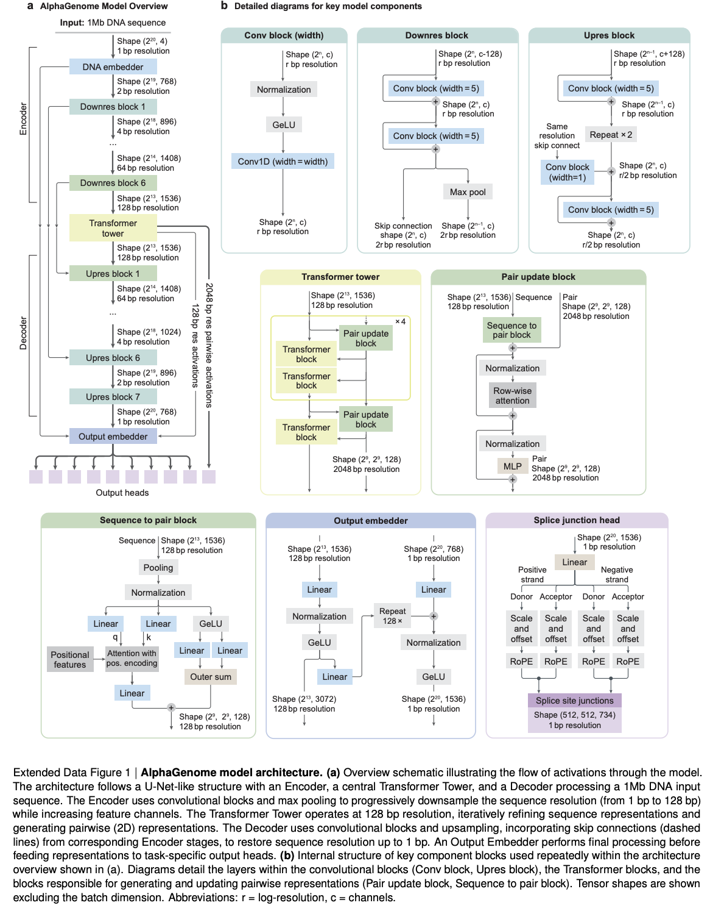

</img>

## AlphaGenome (wip)

Implementation of [AlphaGenome](https://deepmind.google/discover/blog/alphagenome-ai-for-better-understanding-the-genome/), Deepmind's updated genomic attention model

## Citations

```bibtex
@article{avsec2025alphagenome,
  title   = {AlphaGenome: advancing regulatory variant effect prediction with a unified DNA sequence model},
  author  = {Avsec, {\v{Z}}iga and Latysheva, Natasha and Cheng, Jun and Novati, Guido and Taylor, Kyle R and Ward, Tom and Bycroft, Clare and Nicolaisen, Lauren and Arvaniti, Eirini and Pan, Joshua and Thomas, Raina and Dutordoir, Vincent and Perino, Matteo and De, Soham and Karollus, Alexander and Gayoso, Adam and Sargeant, Toby and Mottram, Anne and Wong, Lai Hong and Drot{\'a}r, Pavol and Kosiorek, Adam and Senior, Andrew and Tanburn, Richard and Applebaum, Taylor and Basu, Souradeep and Hassabis, Demis and Kohli, Pushmeet},
  year    = {2025}
}
```
